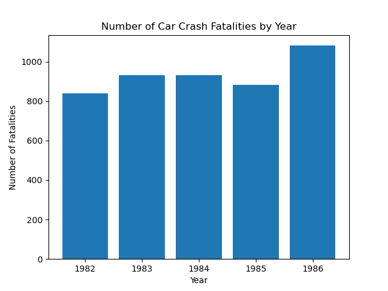

# Github Actions Matrix 
#### Project that builds a GitHub Actions matrix to test multiple versions of python for MiniProj 2 (Descriptive Stats with Pandas)
---
#### Requirements:

- [X] Set up a Gitlab Actions workflow
- [X] Test across at least 3 different Python versions
- ##### Other:
- [X] Generate summary statistics (mean, median, standard deviation)
- [X] Create at least one data visualization
- [X] Python script 
- [X] CI/CD with badge

---
### Folder Navigation
##### Here is a quick overview of how the folders are structured for this project:
---
- Project Folder
    - .devcontainer
        - devcontainer.json
        - Dockerfile
    - .github
        - workflows
            - matrix.yml
    - python_files
        - outputs
            - output.png
        - test_files
            - test_lib.py
            - test_main.py
        - lib.py
        - main.py
    - Makefile
    - README.md
    - requirements.txt
---
### Workflow Summary and Explanation
##### This project contains the following dependencies:
- pylint 
- black
- pytest
- pandas
- matplotlib
- ruff
- boto3
- tabulate

---
### Descriptive Statistics Table
---
###### The following table is the main.py output, indicating the count, mean, std, min, quartiles, and max for the numeric variables
|       |       year |    fatal |
|:------|-----------:|---------:|
| count |  336       |  336     |
| mean  | 1985       |  928.664 |
| std   |    2.00298 |  934.051 |
| min   | 1982       |   79     |
| 25%   | 1983       |  293.75  |
| 50%   | 1985       |  701     |
| 75%   | 1987       | 1063.5   |
| max   | 1988       | 5504     |

---
### Visualizations
---
###### The following graph is a visualization created by the script, which displays a comparison of the number of driving fatalities per year reported in the dataset:

